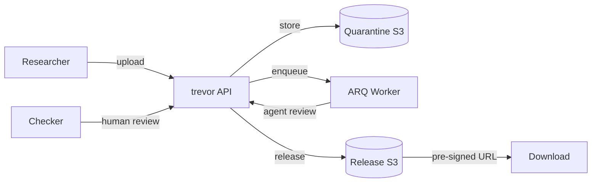

# Architecture

## Overview

trevor is a FastAPI microservice that mediates file transfer across a TRE security boundary. It enforces a dual-review workflow before any research output can leave (egress) or enter (ingress) the trusted environment.



## Technology stack

| Layer | Technology |
|-------|-----------|
| Backend | FastAPI |
| Validation | Pydantic v2 |
| ORM | SQLModel |
| Migrations | Alembic (async; `aiosqlite` locally, `asyncpg` in prod) |
| Linting/formatting | `ruff` |
| Pre-commit | `prek` |
| Frontend | Datastar (hypermedia + SSE; no JS build step) |
| Templating | Jinja2 |
| Object storage | `aioboto3` (S3-compatible) |
| Task queue | ARQ (async Redis queue) |
| Auth | Keycloak OIDC (`python-jose` for JWT) |
| Orchestration | Kubernetes (Tilt + k3d/kind for local dev) |
| Agent framework | Pydantic-AI (OpenAI-compatible backend) |
| RO-Crate | `rocrate` Python library |
| File preview | `mistune`, `polars`, `pygments`, `nh3` |

Stack is fixed by [constraint C-13](spec/constraints.md). Deviations require a new ADR.

## Application patterns

### App factory

`create_app(settings)` in `app.py`. Module-level `app = create_app()` for uvicorn. Lifespan handler creates SQLite tables in dev (Alembic in prod).

### Dependency injection

FastAPI `Depends()` throughout:

- `get_session` — async SQLModel session
- `get_settings` — pydantic-settings singleton
- `get_auth_context` — resolves caller identity from JWT, upserts User shadow record
- `CurrentAuth` / `RequireAdmin` — type aliases for auth dependencies

Tests override via `app.dependency_overrides`.

### Engine caching

`get_engine(url)` uses `@lru_cache` — one engine per database URL. Tests use `sqlite+aiosqlite:///:memory:`.

### Auth model

`AuthContext` dataclass holds:

- `user: User` — DB model (shadow record from Keycloak)
- `realm_roles: list[str]` — from JWT `realm_access.roles`
- `is_admin: bool` — true if `tre_admin` in roles

`DEV_AUTH_BYPASS=true` skips JWT validation for tests and local dev. Creates `dev-bypass-user` or `dev-bypass-admin` based on Bearer token content.

### User upsert

On every authenticated request, `upsert_user()` creates or updates a User shadow record from Keycloak claims. Users may also be pre-created from CRD sync with nullable `keycloak_sub`. Keycloak is source of truth for identity ([C-10](spec/constraints.md)).

### Notification system

`notification_service.py` implements a backend-agnostic notification dispatch pipeline:

- **`NotificationEvent`** — immutable dataclass carrying event type, title, body, request ID, and resolved recipient user IDs
- **`NotificationBackend`** protocol — `InAppBackend` writes `Notification` rows to the DB; `SmtpBackend` sends email via `aiosmtplib` (enabled by `EMAIL_NOTIFICATIONS_ENABLED`); further backends implement the same protocol
- **`NotificationRouter`** — fans out to all registered backends with per-backend error isolation
- **`send_notifications_job`** — ARQ background job that resolves recipients, builds the event, and dispatches; fired by `agent_review_job`, `release_job`, and the submit endpoint

Recipient resolution: checker events (`request.submitted`, `agent_review.ready`) go to all output_checker / senior_checker members of the project; researcher events (`request.approved`, `request.released`, etc.) go to the submitter.

### SSE live updates

`sse.py` provides three Datastar-compatible SSE helpers:

- **`format_fragment_event`** — wraps an HTML string as a `datastar-merge-fragments` SSE event; multi-line HTML is split across multiple `data:` lines
- **`sse_stream`** — async generator that polls a `poll_fn` every 2 seconds for up to 5 minutes, yielding only when the HTML fragment changes (delta suppression)
- **`sse_response`** — wraps an async generator as a `StreamingResponse` with `text/event-stream` content type

`routers/sse.py` exposes three endpoints, all under `/ui/sse/`:

| Endpoint | Fragment ID | Description |
|---|---|---|
| `GET /ui/sse/requests/{id}/status` | `request-status-badge` | Live status badge for a single request |
| `GET /ui/sse/review/queue-count` | `review-queue-count` | Live count of reviewable requests (checkers only) |
| `GET /ui/sse/notifications/count` | `notification-count` | Live unread notification count (nav badge) |

Each endpoint uses `get_sse_session_factory` (a FastAPI dep, overridable in tests) so the poll loop uses the same DB engine as the rest of the test session.

### CRD sync

`crd_sync_service.py` reconciles CR8TOR CRDs into the postgres DB every 5 minutes (ARQ cron, `run_at_startup=True`):

- Reads `projects.research.karectl.io` CRs → upserts `Project` rows; uses `spec.display_name` → `spec.description` → `metadata.name` for the human-readable name
- Reads `users.identity.karectl.io` CRs → upserts `User` rows
- Reads `groups.identity.karectl.io` CRs with analyst/researcher membership → assigns `researcher` `ProjectMembership`; checker roles are trevor-internal and not derived from Group CRDs

`validate_no_role_conflict()` prevents a user from being both researcher and checker on the same project ([C-04](spec/constraints.md)). Checked before every membership create.

### Audit trail

`audit_service.emit()` records every state transition, upload, review, and metadata change. The `AuditEvent` table is append-only — no UPDATE or DELETE ever ([C-05](spec/constraints.md)).

## Project layout

```
src/trevor/
  __init__.py              # main() entrypoint → uvicorn
  app.py                   # FastAPI factory, lifespan, router registration
  settings.py              # pydantic-settings BaseSettings (all env vars)
  database.py              # async engine, session factory, get_session dep
  auth.py                  # AuthContext dep, DEV_AUTH_BYPASS, require_admin
  storage.py               # aioboto3 S3 abstraction
  worker.py                # ARQ WorkerSettings, agent_review_job, release_job, send_notifications_job, url_expiry_warning_job, stuck_request_alert_job, crd_sync_job
  agent/
    rules.py               # statbarn rule engine (9 rules, pure functions)
    agent.py               # Pydantic-AI agent orchestration + LLM narrative
    prompts.py             # system prompt, template-based narratives
    schemas.py             # RuleResult, ObjectAssessment dataclasses
  models/
    user.py                # User
    project.py             # Project, ProjectMembership, ProjectRole
    request.py             # AirlockRequest, OutputObject, OutputObjectMetadata, AuditEvent
    review.py              # Review, ReviewerType, ReviewDecision
    notification.py        # Notification, NotificationEventType
  schemas/                 # Pydantic read/write schemas for each model
  services/
    user_service.py        # upsert_user
    membership_service.py  # CRUD + role conflict validation
    audit_service.py       # emit() helper
    release_service.py     # RO-Crate assembly, zip building
    metrics_service.py     # admin dashboard queries, pipeline metrics
    notification_service.py  # NotificationEvent, InAppBackend, SmtpBackend, NotificationRouter, get_router
    preview_service.py       # render_preview — CSV/TSV/Parquet/Markdown/code/image → sanitised HTML
    email_templates/         # 7 event dirs (subject.txt, body.html, body.txt) for SmtpBackend
    crd_sync_service.py    # CRD reconcile logic (projects, users, researcher memberships)
   routers/
     users.py               # /users/me
     projects.py            # /projects
     memberships.py         # /memberships
     requests.py            # /requests (CRUD + submit + upload)
     reviews.py             # /requests/{id}/reviews
     releases.py            # /requests/{id}/release
     notifications.py       # /notifications (list, unread-count, mark-read)
     admin.py               # /admin (requests, metrics, audit)
     sse.py                 # /ui/sse (SSE live update streams)
     ui.py                  # /ui (Datastar HTML views, including /ui/notifications)
   sse.py                   # SSE helpers: format_fragment_event, sse_stream, sse_response
   templates/               # Jinja2 templates for Datastar UI
   static/                  # CSS (no JS build step)
tests/
  conftest.py              # fixtures: in-memory SQLite, clients, sample data
  test_*.py                # 252 tests across 18 test files
alembic/                   # async Alembic config + migrations
docs/                      # this documentation (zensical)
  runbook.md               # deployment, migrations, failure modes, monitoring, scaling
  security-checklist.md    # CSRF, rate limiting, auth, secrets, container security
helm/trevor/               # Helm chart skeleton
deploy/dev/
  crds/                    # CRD schema definitions
  sample-project/          # Interstellar project CRs + dev user/group CRs
```

## Environment variables

| Variable | Purpose | Default |
|----------|---------|---------|
| `DATABASE_URL` | DB connection | `sqlite+aiosqlite:///./local/trevor.db` |
| `DEV_AUTH_BYPASS` | Skip JWT validation | `false` |
| `REDIS_URL` | ARQ queue | `redis://localhost:6379/0` |
| `KEYCLOAK_URL` | Keycloak base URL | — |
| `KEYCLOAK_REALM` | Realm name | `karectl` |
| `KEYCLOAK_CLIENT_ID` | OIDC client ID | `trevor` |
| `S3_ENDPOINT_URL` | MinIO URL (local dev) | — |
| `S3_ACCESS_KEY_ID` | S3 credentials | — |
| `S3_SECRET_ACCESS_KEY` | S3 credentials | — |
| `S3_QUARANTINE_BUCKET` | Upload bucket | `trevor-quarantine` |
| `S3_RELEASE_BUCKET` | Release bucket | `trevor-release` |
| `AGENT_OPENAI_BASE_URL` | LLM endpoint | — |
| `AGENT_MODEL_NAME` | LLM model | `gpt-4o` |
| `AGENT_API_KEY` | LLM API key | — |
| `AGENT_LLM_ENABLED` | Enable LLM calls | `false` |
| `NOTIFICATIONS_ENABLED` | Enable in-app notifications | `true` |
| `EMAIL_NOTIFICATIONS_ENABLED` | Enable SMTP email backend | `false` |
| `SMTP_HOST` | SMTP server hostname | `localhost` |
| `SMTP_PORT` | SMTP server port | `587` |
| `SMTP_FROM_ADDRESS` | Envelope From address | `trevor@karectl.example` |
| `SMTP_USE_TLS` | STARTTLS on connect | `true` |
| `SMTP_USERNAME` | SMTP auth username | `""` |
| `SMTP_PASSWORD` | SMTP auth password | `""` |
| `TREVOR_BASE_URL` | Base URL used in email links | `http://localhost:8000` |
| `STUCK_REQUEST_HOURS` | SLA threshold | `72` |
| `PRESIGNED_URL_TTL` | Release URL TTL (seconds) | `604800` (7 days) |
