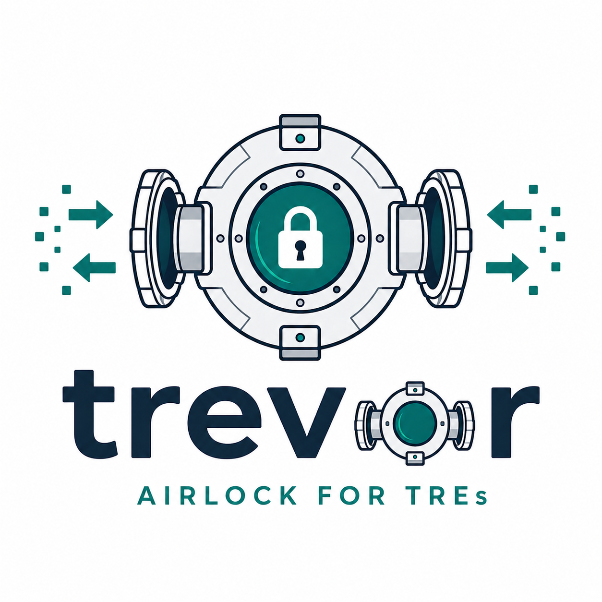

# trevor

Egress/airlock microservice for the KARECTL Trusted Research Environment (TRE). Manages controlled import and export of research objects (code, outputs, etc.) across the TRE security boundary.
<p align="center">
    
</p>


## What trevor does

trevor sits at the boundary of a secure research environment. Researchers produce outputs (tables, figures, models, reports) inside the TRE workspace. Before those outputs can leave the secure environment, they must pass through trevor's airlock:

1. **Researcher** creates a request and uploads output objects
2. **Agent** automatically reviews outputs against statistical disclosure rules
3. **Human checkers** review the agent's report and make a final decision
4. **Approved outputs** are packaged as an RO-Crate and released via pre-signed URL

The same workflow applies in reverse for **ingress** — bringing external data into the TRE.

## Key properties

- **Dual review** — every request requires two reviewers (agent + human, or two humans)
- **Immutable objects** — uploaded files cannot be modified, only replaced with new versions
- **Complete audit trail** — every action is recorded in an append-only log
- **No direct storage access** — researchers never hold S3 credentials
- **Kubernetes-native** — runs exclusively on Kubernetes, reads project data from CRDs

## Current status

Iterations 0–14 are complete. The system has:

- Full request lifecycle (create, upload, submit, review, revise, release)
- Autonomous agent review with 9 statbarn rules
- Human review with per-object decisions
- Object versioning and metadata management
- RO-Crate assembly and pre-signed URL delivery
- Admin dashboard with pipeline metrics and audit log
- In-app notification system (bell badge, notification inbox, mark-read)
- CRD sync reconciler — projects and users synced from CR8TOR CRDs every 5 minutes
- Datastar-powered UI for all roles (researcher, checker, admin)
- Local development environment (devcontainer, bare-metal scripts, Tiltfile, SeaweedFS, Keycloak, PostgreSQL, Redis)
- Production-ready Helm chart (Service, Ingress, HPA, PDB, NetworkPolicy, Worker, migration Job, NOTES.txt)
- **195 tests passing**

See the [iteration plan](spec/iteration-plan.md) for what's next.

## Quick start

```bash
uv sync                    # install dependencies
uv run pytest -v           # run tests (195 passing, no external deps needed)
uv run trevor              # run app (uvicorn on :8000)
uv run zensical serve      # serve these docs
```

## Documentation structure

| Section | Contents |
|---------|----------|
| [Architecture](architecture.md) | System design, patterns, technology stack |
| [API Reference](api.md) | All HTTP endpoints |
| [UI Guide](ui.md) | Datastar-powered web interface |
| [Developer Guide](guide/index.md) | Local dev setup, testing, contributing |
| [Spec](spec/index.md) | Domain model, constraints, ADRs, iteration plans |
